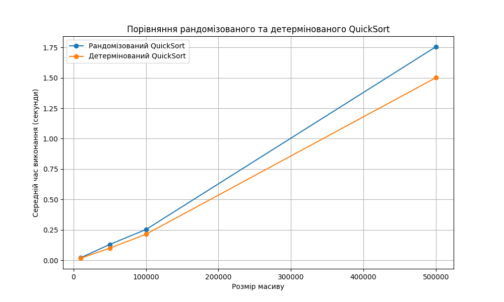

# Порівняння рандомізованого та детермінованого QuickSort

Розмір масиву: 10 000

- Рандомізований QuickSort: 0.0215 секунд
- Детермінований QuickSort: 0.0174 секунд

Розмір масиву: 50 000

- Рандомізований QuickSort: 0.1306 секунд
- Детермінований QuickSort: 0.1001 секунд

Розмір масиву: 100 000

- Рандомізований QuickSort: 0.2533 секунд
- Детермінований QuickSort: 0.2145 секунд

Розмір масиву: 500 000

- Рандомізований QuickSort: 1.7548 секунд
- Детермінований QuickSort: 1.5008 секунд

## Аналіз результатів:

1. **Час виконання**:  
   Для кожного розміру масиву рандомізований QuickSort працює повільніше, ніж детермінований. Наприклад, для масиву розміром 500,000 елементів рандомізований QuickSort виконався за **1.7548 секунд**, тоді як детермінований — за **1.5008 секунд**.

2. **Причини різниці**:

- Завдяки випадковому вибору опорного елемента (pivot), рандомізований QuickSort у середньому працює швидше, ніж його детермінований варіант, особливо на частково відсортованих масивах. Це дозволяє уникнути гірших випадків, коли вибір опорного елемента може бути невдалим.
- Однак у нашому випадку масиви наповнюються випадковими числами, тому ймовірність частково відсортованих масивів дуже низька.
- Рандомізований QuickSort має додаткові накладні витрати через використання функції `random.randint`, що впливає на загальний час виконання.

3. **Ефективність детермінованого QuickSort**:  
   Якщо дані в масиві мають рівномірний розподіл, детермінований QuickSort може працювати ефективніше, оскільки вибір середнього елемента зазвичай забезпечує оптимальний поділ масиву.

## Висновок:

Рандомізований QuickSort є більш універсальним алгоритмом, який краще справляється з гіршими випадками, наприклад, частково відсортованими масивами. Проте, у випадку випадкових даних, як у цьому тесті, детермінований QuickSort демонструє кращу продуктивність через відсутність накладних витрат на вибір опорного елемента.

Для практичного використання вибір між цими алгоритмами залежить від характеру даних:

- Якщо дані можуть бути частково відсортованими або структура даних невідома, рандомізований QuickSort є кращим вибором.
- Якщо дані рівномірно розподілені, детермінований QuickSort може забезпечити кращу продуктивність.
